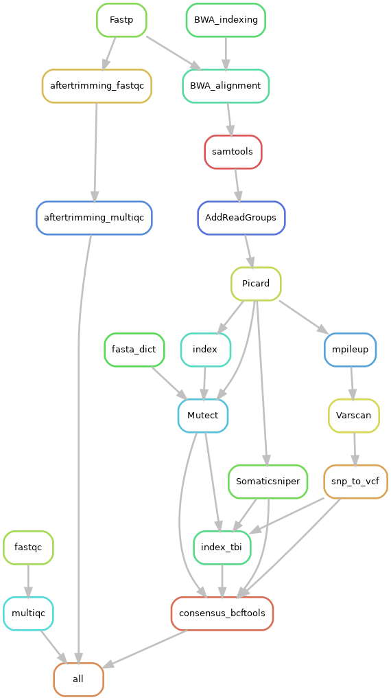

# TAA_somatic_snakemake
Marie Hannaert\ 
Centrum Medical Genetics Antwerp 

This pipeline will process the files after deep WES, to see if there are any mutations in the somatic cells. It will at the end of the pipeline use multiple specific variant callers for somatic variants, compare these results and make a consensus of these results. 

## Installing the TAA somatic pipeline
Snakemake is a workflow management system that helps Snakemake is a workflow management system that helps create and execute data processing pipelines. It requires Python 3 and can be easily installed via the Bioconda package.

### Installing conda 
Look at the conda documentation for installing this. [Conda](https://docs.conda.io/projects/conda/en/latest/user-guide/install/index.html)
You will also need Biconda. [Bioconda](https://bioconda.github.io/)

### Installing Snakemake
Use the snakemake documentation for installing Snakemake als a conda package.
[Snakemake](https://snakemake.readthedocs.io/en/stable/getting_started/installation.html)

### Downloading the pipeline 
You can download the pipeline from github. This will include: Snakefile, scripts and the needed enviroment, to your local machine. It's good practice to create a **Snakemake/** directory to collect all your pipelines. Download the TAA somatic pipeline into your Snakemake directory using: 
````
$ cd Snakemake/ 
$ git clone https://github.com/MarieHannaert/TAA_somatic_snakemake.git
````
### Installing the enviroment 
You can install the enviroment by using the TAA_somatic_pipeline.yaml in the envs directory. 
````
$ cd TAA_somatic_snakemake/
$ conda enc create -f envs/TAA_somatic_pipeline.yaml
````
## Executing the pipeline 
Before you can run the pipeline you need to prepare some steps. 
### Preparing 
First activate the conda enviroment by running the following command: 
````
$ conda activate TAA_somatic_pipeline
````
Normally infront of your promt the enviroment will appear. 

Go to the directory: 
````
$ cd TAA_somatic_snakemake/
````

Secondly you need to place the samples you want to analyse in the data directory this can be done with the following command: 
````
$ ln <path to your samples> data/
````
Now you are ready to run the pipeline. 

### Executing the pipeline 
In the directory you can run the pipeline in different ways.
With slurm you need a .config/snakemake/slurm/config.yaml, this file contains information on how snakemake may use the resources. More information can be found in the documentation of snakemake [Snakemake_slurm](https://snakemake.readthedocs.io/en/stable/executing/cli.html).
If you have this you can run the pipeline with the following command in the pipeline directory: 
````
$ snakemake --profile ../.config/snakemake/slurm --verbose --rerun-incomplete --latency-wait 36000
````
If you are running without slurm (which is not advisable) the following command is used: 
````
$ snakemake -p --cores $(nproc) --verbose --rerun-incomplete --latency-wait 36000
````
## Overview of the TAA somatic pipeline
